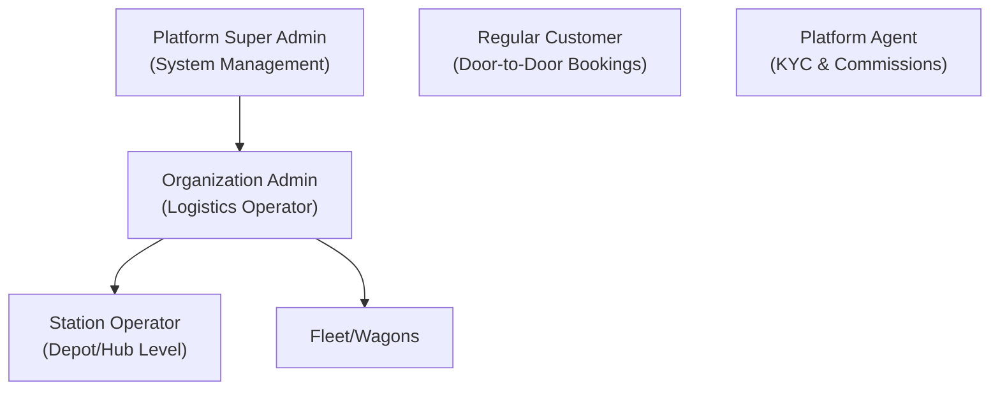
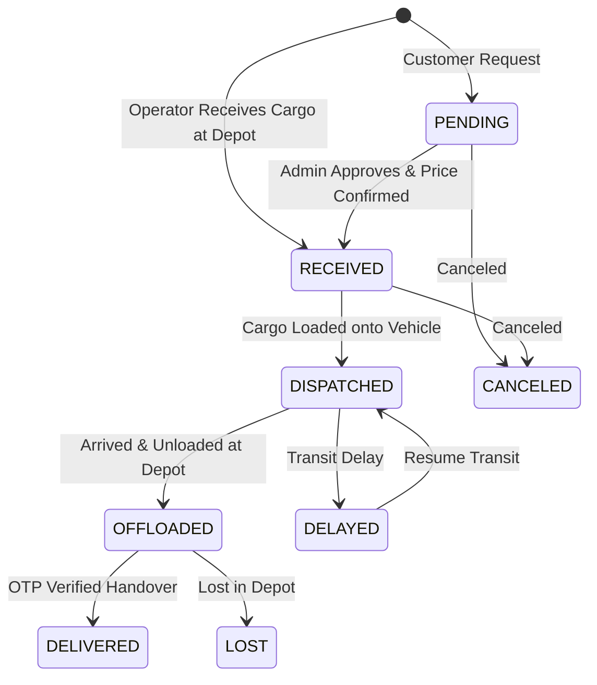

# Mizigo Logistics Platform: Functional & Business Documentation

Welcome to the business and operational documentation for the **Mizigo Logistics Platform**. Mizigo is a multi-tenant, station-based cargo booking and tracking system designed to streamline logistics operations, automate pricing calculations, secure payments, and coordinate rail and road cargo workflows.

---

## 1. System Architecture & Tenancy Model

Mizigo is built on a multi-tenant, hierarchical access model to ensure strict operational boundaries and security across different business tiers.

### 1.1 Stakeholder Roles & Access Levels
1. **Platform Super Admin**: Oversees the entire ecosystem. Manages tenant onboarding (organizations), sets global default system parameters, reviews platform agents' credentials, and has access to system-wide audit reports.
2. **Organization Admin (Logistics Operator)**: Scoped to a single logistics company. Manages depot stations, customizes pricing structures, configures regional carrier vehicles, oversees user accounts, and analyzes performance reports.
3. **Station Operator (Depot Agent)**: Scoped to a specific cargo station or warehouse. Handles daily package operations, including cargo reception, dispatch, offloading, and secure OTP verification during handovers.
4. **Platform Agent**: Third-party independent or business partner registered to book parcels. Earns volume-based commissions subject to compliance (KYC) approval.
5. **Regular Customer**: Public users who submit door-to-door cargo requests, check rates, and track active deliveries.

---

## 2. Platform Structure & Module Overview

Mizigo combines multiple unified modules to deliver a seamless operational experience across different devices:

*   **Administration Portal**: A web-based dashboard allowing Platform Admins and Organization Admins to manage finances, view live transit data, adjust pricing rules, and manage users.
*   **Operations Hub (Mobile App)**: A mobile interface designed for depot operators to handle scanner-centric operations (scanning bar/QR codes, receiving parcels, loading wagons, and delivering parcels).
*   **Customer Portal**: Mobile and web interfaces for customers to book shipments, calculate rates, and track parcels in real time.
*   **Data Core**: The central system repository maintaining secure, isolated records for all transactions, user roles, transit histories, and system events.

---

## 3. End-to-End Parcel Lifecycle & Workflow

Every parcel moves through a structured, audited lifecycle to guarantee delivery confirmation and prevent unauthorized status changes.

### 3.1 Workflow Step-by-Step

#### Step 1: Booking & Cargo Reception
*   **Depot Bookings (Operator-Mediated)**:
    1. A customer drops off a package at a depot. The Operator enters package attributes (dimensions, weight, type, declared value, urgency, payment mode).
    2. The system checks for railway integration availability (TRC SGR) to calculate SGR tariffs and register the cargo. If unavailable, it calculates the rate using custom local rules.
    3. The system generates a unique **Tracking Number** and a secure **Delivery OTP** (One-Time Password).
    4. The cargo is marked as **`RECEIVED`** at the depot.
    5. The sender and receiver immediately receive an SMS receipt containing the tracking link and the delivery OTP.
*   **Customer Self-Service Requests**:
    1. A customer submits a pickup request online. The parcel enters the system in a **`PENDING`** state.
    2. An admin reviews the request, adjusts the pricing based on physical parameters, assigns it to a carrier depot, and approves the booking.

#### Step 2: Dispatch & Loading
1. The depot operator packages the cargo, groups it with other parcels, and assigns it to a dispatch vehicle (e.g., SGR Train Wagon or Cargo Truck) for a specific travel date.
2. The parcel status transitions to **`DISPATCHED`**.
3. The recipient receives a **Departure SMS** detailing the carrier info and confirming the delivery OTP.

#### Step 3: Offloading & Station Arrival
1. Upon arrival at the destination depot, the receiving operator scans the parcel.
2. The system registers the parcel status as **`OFFLOADED`** (arrived at station).
3. The recipient automatically receives an **Arrival SMS** notifying them that their package is ready for collection at the depot.

#### Step 4: Verification & Delivery
1. The recipient arrives at the destination depot to claim their package.
2. The operator searches the tracking number and prompts the receiver for the **Delivery OTP**.
3. The operator inputs the OTP. The system verifies the code.
4. Upon successful validation, the status is set to **`DELIVERED`**, and the handover is recorded.

---

## 4. Key Business Engines & Integrations

### 4.1 Intelligent Pricing Engine
Mizigo dynamically determines shipment costs based on a multi-tier logic:
1. **Tier 1 (Customer-Specific Overrides)**: Custom pricing rules set by organization administrators for specific clients or routes take precedence.
2. **Tier 2 (Physical & Urgency Parameters)**: Fees are determined using formulas that weigh base fees, weight brackets, declared value bands (for insurance/liability), and delivery urgency.
3. **Tier 3 (Railway Tariffs)**: Integrates directly with TRC SGR to match railway-specific categories and live distance-based cargo tariffs.

### 4.2 Mizigo Payment Gateway
Facilitates payment collection and automated financial management:
*   **Payment Channels**: Integrates with major mobile money networks (such as M-Pesa, Tigo Pesa, and Airtel Money) to support USSD push payments.
*   **Flexible Payment Models**: Supports both *Pay-As-You-Go* (sender pays upfront) and *To-Pay* (payment completed upon delivery).
*   **Revenue Splits**: Automatically calculates and tracks the distribution of gross revenues, separating **System Fees**, **Operator Commissions**, and **Net Organization Earnings** per transaction.

### 4.3 Automated SMS Communication Gateway
Provides instant updates to keep customers informed:
*   **Multi-tenant Branding**: Resolves organization-specific SMS configurations to customize sender IDs.
*   **Real-time Alerts**: Triggers automated status updates (Booking Confirmations, Dispatch Notifications, Arrival Alerts, and Delivery Receipts) in Swahili and English.

### 4.4 SGR Railway Portal Integration
Directly links Mizigo to the Tanzania Railways Corporation (TRC) SGR e-cargo system:
*   **Fare Estimation**: Synchronizes weight and station-to-station data with SGR to request live transport costs.
*   **Booking Sync**: Creates duplicate cargo bookings on the railway network to receive official transport references, ensuring smooth handovers to train operations.
